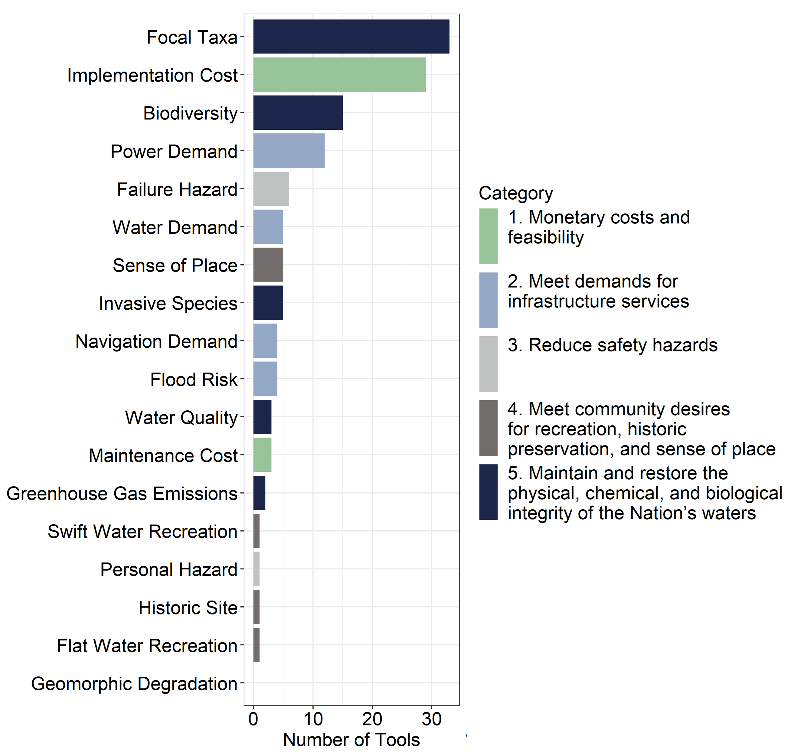
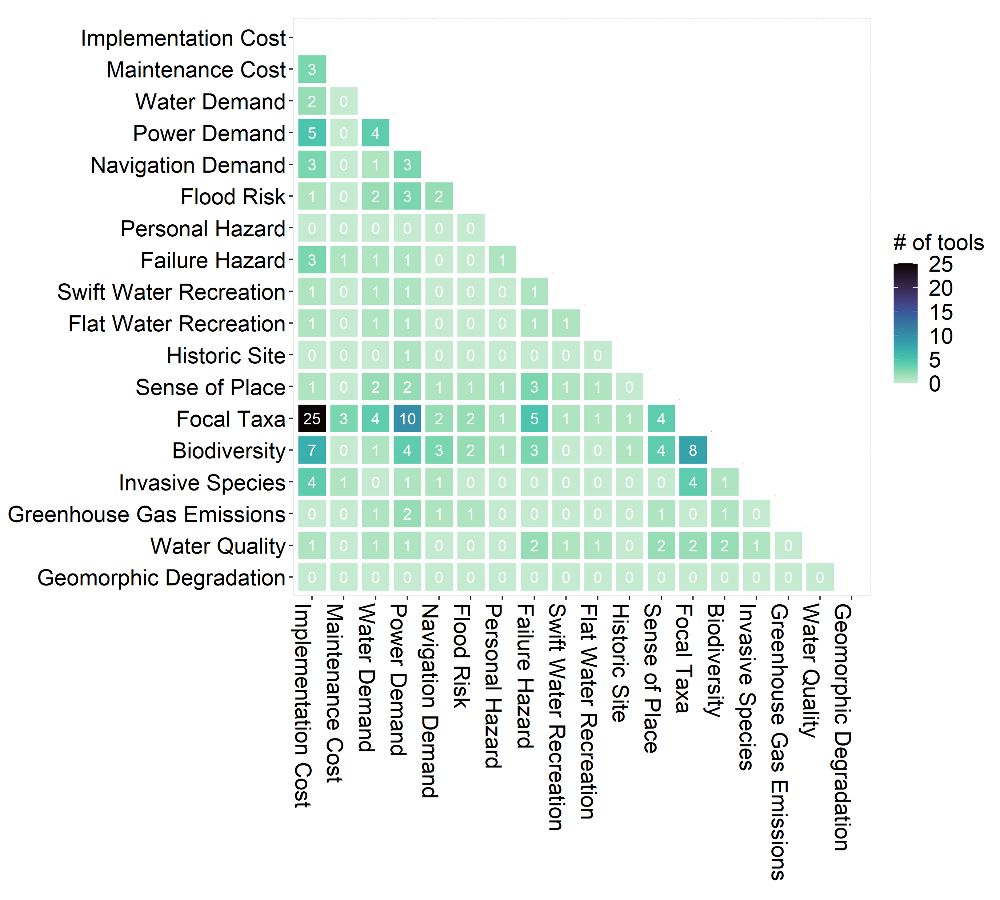
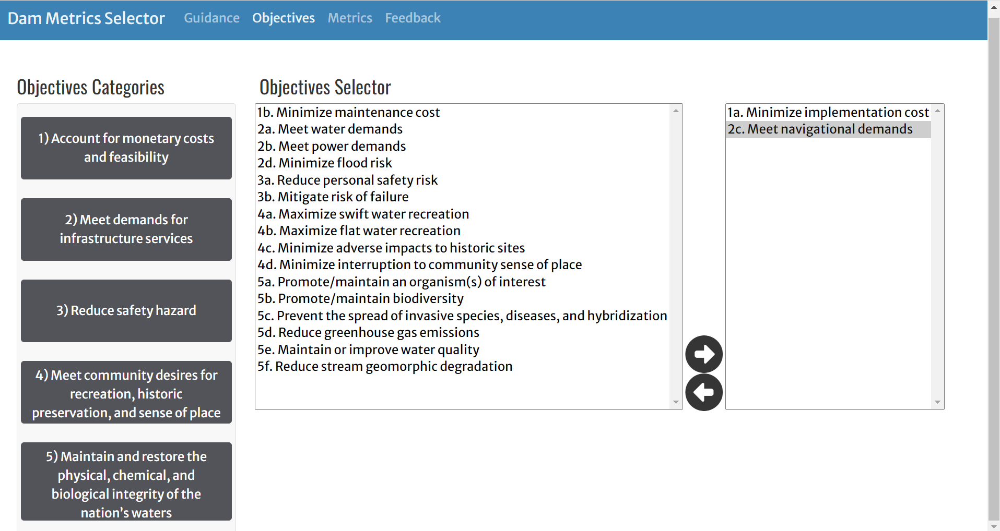
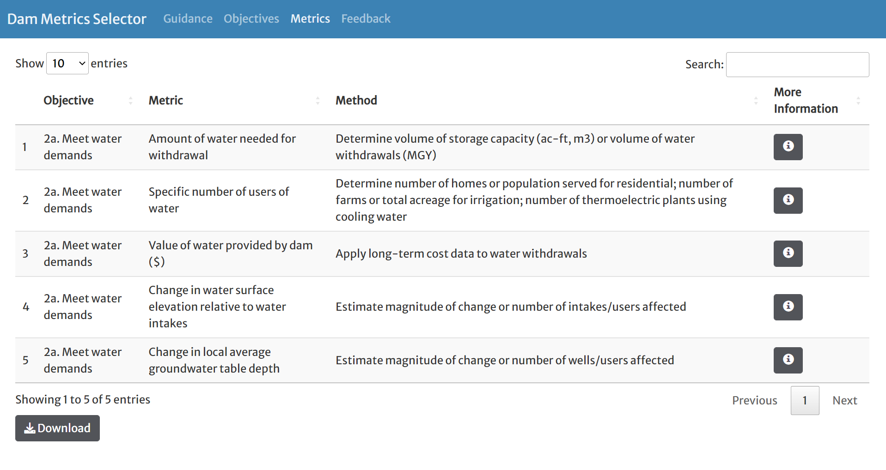

```{r setup, include=FALSE}
knitr::opts_chunk$set(echo = TRUE)
```

<style type="text/css">
  .watermark {
  opacity: 0.2;
  position: fixed;
  top: 0;
  left: 10%;
  right: 0;
  bottom: 0;
  z-index: -1;
  justify-content: center;
  align-content: center;
  font-size: 10em;
  color: #00407d;
  transform: rotate(-45deg)
}
</style>

<div class="watermark">DRAFT</div>

## Linking objectives of dam decommissioning decisions with metrics to facilitate structured decision making

*The following guidance is a draft ERDC technical note prepared as part of the Network for Engineering with Nature (N-EWN, https://n-ewn.org). It has not been peer-reviewed. Opinions expressed here are those of the authors and not necessarily those of the agencies they represent or the N-EWN*


Laura C. Naslund^1^, Daniel Buhr^2^, Matt Chambers^2^, Suman Jumani^3^, Brian Bledsoe^2^, Seth Wenger^1^, S. Kyle McKay^3^

^1^Odum School of Ecology & River Basin Center, University of Georgia  
^2^School of Environmental, Civil, Agricultural, and Mechanical Engineering & The Institute for Resilient Infrastructure Systems (IRIS), University of Georgia  
^3^U.S. Army Engineer Research and Development Center, Environmental Laboratory  

### ABSTRACT
Proactive and transparent decision making about the long-term management of dams is critical for successfully managing this aging infrastructure and presents an opportunity to weigh the many services and disservices these structures provide. Many tools have been developed to support structured decision making about dams, which have the potential to greatly increase the efficiency and scope of dam removal, retrofit, and repair decisions.  However, these tools may constrain thinking by omitting important services and disservices that should be part of the decision. We therefore conducted a literature review to define these objectives and evaluate those included in 41 existing decision-support tools. Of the 18 potential dam management objectives that we identified, we found that most tools included only two or three. To promote the future inclusion of these diverse objectives in decision support tools, we compiled from the literature the metrics and methods which quantify the extent to which a management alternative achieves an objective. We contributed additional metrics and methods where we found gaps in the literature. We then compiled this information into an interactive web application which we envision as a dynamic resource for the dam management community of practice. 

### INTRODUCTION
Dam infrastructure has been critical to the economic development of the United States, but many dams and their reservoirs have exceeded their design lifetimes and are no longer fulfilling their constructed purpose (Gonzales & Walls, 2020). Decades of disinvestment in maintaining this infrastructure have also led to significant deficiencies, such that the American Society of Civil Engineers rated dams as one of the worst performing categories of infrastructure in the country (ASCE, 2021). The estimated cost to repair all known deficient, non-federal dams in the US would total $76 billion (ASDSO, 2022). For many deficient dams, removal may be a more economically efficient alternative to repair, particularly when the dam no longer serves its constructed purpose (Doyle, Stanley, et al., 2003; Grabowski et al., 2018; IEC, 2015). Even for functioning dams, removal may be the best long-term management strategy due to benefits for e.g., wildlife, water quality, recreation, and flood risk mitigation (Hansen et al., 2020). 
	The decision of whether to decommission a dam, or which dams to decommission, requires weighing the many services and disservices provided by a dammed versus a free-flowing stream, which can vary greatly according to local context (Habel et al., 2020). Additionally, dam decommissioning decisions encompass multiple scales of complexity including variation in the number and spatial relationship of dams considered for removal, variation in dam size and impounded volume, and diverse ownership and relevant legal authorities (McKay et al., 2020). In part due to this complexity, many dams have been removed in an ad hoc manner despite calls for structured decision making and coordinated dam removal over the past two decades (Doyle, Harbor, et al., 2003; Neeson et al., 2015). The $2.4 billion allocated for dam decommissioning, rehabilitation, and retrofit in the 2021 Infrastructure Investment and Jobs Act (Pub. L. 117-58), however, may open the policy window for coordinated dam removal, repair, and retrofit. 


**Existing decision support tools**
Given the complexity of these decisions, several organizations have developed decision tools which support structured decision making about long term dam management. These tools have the potential to greatly increase the speed and scope of dam removal decisions; however, these tools may constrain users if they do not include all of the objectives of the decision problem. Identifying these objectives is a critical early step in structured decision making, including in the PrOACT framework which has been employed in a diverse natural resources and infrastructure management settings (Gregory & Keeney, 2002). For this reason, we evaluated existing multi-objective dam removal decision support tools to determine whether they included common long-term dam management decision objectives. 	We conducted a preliminary literature review to develop an initial list of objectives in long term dam management decisions. We then refined this list as we conducted a systematic review of existing multicriteria dam removal decision support tools to determine the frequency of inclusion of our identified objectives. We organized our 18 identified objectives into five categories:

1. Account for monetary costs and feasibility
	+ 1a. Minimize implementation costs
	+ 1b. Minimize maintenance costs
2. Meet demands for infrastructure services
	+ 2a. Meet water demands
	+ 2b. Meet power generation demands
	+ 2c. Meet navigation demands
	+ 2d. Reduce flood risk
3. Reduce safety hazard
	+ 3a. Reduce personal safety risk
	+ 3b. Mitigate risk of failure
4. Meet community desires for recreation, historic preservation, and sense of place
	+ 4a. Maximize swift water recreational opportunities
	+ 4b. Maximize flat water recreational opportunities
	+ 4c. Minimize adverse impacts to sites judged by the community, state, or Nation to be 		historically significant places
	+ 4d. Minimize interruption to community sense of place
5. Maintain and restore the physical, chemical, and biological integrity of the nation’s waters
	+ 5a. Promote/maintain a population or community of focal taxa
	+ 5b. Promote/maintain biodiversity
	+ 5c. Prevent the spread of invasive species, disease, or undesirable hybridization
	+ 5d. Reduce greenhouse gas emissions
	+ 5e. Maintain or improve water quality
	+ 5f. Reduce stream geomorphic degradation

We conducted a Web of Science search on April 11, 2022, using the search strings “(multiobjective OR multi-objective OR multicriteria OR multi-criteria) AND dam removal” as well as "prioritiz* AND (dam removal OR dam decommissioning)"). From the 86 results, we identified 9 additional relevant papers which were not captured in our original search. We also reviewed 13 river barrier prioritization tools identified by American Rivers (American Rivers, 2022). We included tools returned by these search parameters which concerned optimal siting for dam construction, as many criteria are shared between dam construction and removal decision problems. We did not include papers in our analysis if they only included metrics associated with a single objective (e.g.,Kocovsky et al., 2009) or solely concerned water infrastructure other than dams (e.g., González-Zeas et al., 2019). Of the 108 evaluated tools and papers, 41 met our inclusion criteria. 

Out of 41 dam removal decision support tool tools, only ten included more than three objectives. No tool included the objective *reduce stream geomorphic degradation* and the objectives *reduce personal safety risk*, *maximize swift water recreational opportunities*, *maximize flat water recreational opportunities*, *minimize adverse impacts to sites judged by the community, state or nation to be historically significant places* were each represented in only one tool. The tool with the greatest number of objectives included 9 of the 18 we identified (Brown et al., 2009). *Supporting/maintaining a population or community of focal taxa* was the most frequently included objective (33/41 tools), followed by *minimizing implementation cost* (29/41 tools) (Figure 1). Unsurprisingly these objectives were the most frequently co-occurring, followed by the combination of *supporting/maintaining a population or community of focal taxa* and *meeting power generation needs* (Figure 2). 

```{r fig. 1, echo=FALSE, fig.cap="Figure 1. Frequency of occurrence of identified objectives among existing dam removal decision support tools", out.width = '50%'}

```

```{r fig. 2, echo=FALSE, fig.cap="Figure 2. Frequency of co-occurrence of objectives", out.width = '50%'}

```

### LINKING OBJECTIVES, METRICS, & METHODS
Metrics operationalize objectives in the decision problem by describing the extent to which a proposed alternative achieves an objective (McKay et al., 2012). A given metric can be calculated in different ways; we refer to these ways as different methods. For example, degree of network connectivity, a metric associated with the objective of promoting/maintaining an organism of interest, can be calculated using a method that assumes that dams are completely impassable barriers to the organism, or it can be calculated assuming that a portion of the population can pass a dam, depending on the characteristics of the structure (McKay et al., 2017). To facilitate structured decision-making which accounts for the diverse objectives of long-term dam management, we compiled metrics and methods associated with our 18 identified objectives from the literature and developed additional metrics and methods where we identified gaps. We compiled these linked objectives, metrics, and methods in an [interactive web application](https://lnaslund.shinyapps.io/MCDA/) (https://lnaslund.shinyapps.io/MCDA/). We consider that this tool could be used to populate many different frameworks for evaluating tradeoffs among proposed alternatives (see Alternatives section). We provide additional justification for the metrics/methods that we developed here (Appendix A).

### WEB TOOL
We constructed the Dam Metrics Selector web application using R Shiny (Chang et al., 2022). It is currently hosted on the shinyapps.io server. The Guidance landing page hosts this technical note to provide context on the intended use of this application. On the objectives tab, the user can select from among the listed objectives in the “Objectives Selector” input control box (Figure 3), adapted from Chang (2016). Metrics and methods for objectives placed in the right-hand container will be displayed in a table on the Metrics tab (Figure 4). Objectives can be selected by double clicking the label or using the control arrows. Clicking on the objectives categories labels will pull up dialogue boxes containing justifications for each of the objectives in the selected category. Similarly, clicking the information icon associated with each of the methods in the table in the Metrics tab will pull up a dialogue box containing information about the data requirements and sources for that method as well as citations. Methods not derived from existing published literature are cited as “Authors.” The final Feedback tab provides a space for users to alert the authors to additional resources to include in the application. By this mechanism, we envision the application as a potential, dynamic community resource.  

```{r fig. 3, echo=FALSE, fig.cap="Figure 3. The Objectives tab of the Dam Metrics Selector web application.", out.width = '70%'}

```

```{r fig. 4, echo=FALSE, fig.cap="Figure 4. The Metrics tab of the Dam Metrics Selector web application.", out.width = '70%'}

```

### ALTERNATIVES
A complete discussion of dam removal alternatives is outside of the scope of this technical note; however, we provide some general guidance. The selection of the appropriate metrics and methods may depend on the alternatives under consideration, for example whether the decision involves the prioritization of multiple structures in a watershed or the decision concerns a single structure. In these two cases, a resource efficient proxy may be appropriate for a spatial prioritization (e.g., dam height as an initial proxy for removal cost) while a more resource intensive metric may be appropriate to evaluate alternatives for a single structure (e.g., using a more complex cost model which incorporates sediment remediation, supplanting infrastructure, and permitting cost). 
	In formulating alternatives, it is often beneficial to coordinate decisions about the structure itself and associated sediment management actions, as the consequences of selecting an alternative for the dam structure can vary greatly depending on the sediment management strategy. When a decision involves multiple dams, the sequence of actions may also be a critical component of the alternatives (Randle & Bountry, 2017). Below, we outline four fundamental alternatives for dam and sediment management actions. Within these alternatives, there are many variations which greatly impact the achievement of certain objectives. For example, within the “do nothing” to the structure of the dam alternative, a bypass channel can be constructed which can expand ecological connectivity and may achieve the goal of promoting/maintaining an organism of interest (Raabe et al., 2019; Turek et al., 2016). For more details on the range of dam and sediment management alternatives, we refer readers to the cited references.  

Dam (The Georgia Aquatic Connectivity Team, 2020)

* Do nothing
* Repair/ modify/ reconstruct/ retrofit
* Partially remove
* Completely remove  

Sediment (Morris & Fan, 1998; Randle & Bountry, 2017; USSD, 2015) 

* Leave sediment in place
* Allow sediment to naturally erode
* Channelize and stabilize sediment
* Completely remove sediment

### EVALUATING TRADEOFFS AMONG ALTERNATIVES
The evaluation of alternatives and their trade-offs is an important part of the decision-making process. This step presents decision-makers with the opportunity to evaluate the multi-dimensional costs and benefits of different alternatives to eventually identify a range of options to best achieve identified objectives (Gregory & Keeney, 2002). Several techniques have been used to facilitate an evaluation of competing costs and benefits associated with various alternatives. These include cost-benefit analysis, value-based modeling, optimization techniques, and scoring and ranking systems. Of these, the latter two are the most commonly used family of techniques.  

Optimization analyses (including pareto-optimal models and multi-objective portfolio analysis) have been used to prioritize dam removals or restoration based on the spatial configuration and cumulative impacts of multiple barriers (Kemp & O’Hanley, 2010). In these methods, suitable alternatives are identified based on maximizing a desirable objective (such as some metric of habitat gain or connectivity) subject to a constraint (in terms of budget or number of dams to be removed) (Kuby et al., 2005; O’Hanley, 2011; O’Hanley et al., 2013; O’Hanley & Tomberlin, 2005). We envision that an analyst who wishes to employ optimization methods could use the Dam Metrics Selector tool to identify computationally efficient metrics to parameterize their selected objectives and constraints. Incorporating a larger number of variables within optimization methods, however, remains a challenge as these approaches are data-intensive, complex, and computationally rigorous, potentially impeding their application by non-specialist users and across watersheds.  

Scoring and ranking methods entail the scoring of every alternative based on the costs and benefits associated with various decision criteria. These costs and benefits can be calculated using the metrics and methods which the analyst identifies using the Dam Metrics Selector tool. The analyst then sorts the alternatives by score to develop a ranked list of options. The advantages of this method are its simplicity, flexibility, transparency, and computational efficiency (McKay et al., 2017). This method also allows for the incorporation of variable data types and stakeholder values in the form of weights assigned to the decision criteria. The main drawback of this approach is that options are assessed independently, without accounting for spatial interdependencies when a combination of alternatives is being considered. Hence, this method may lead to inefficient outcomes when simultaneous alternatives are being considered (O’Hanley & Tomberlin, 2005).


### OUTLOOK
Natural resource decision analyses often result in the selection of a suboptimal alternative early in the decision process due to issues defining objectives and selecting appropriate metrics and methods to parameterize those objectives (Hemming et al., 2022). This type of failure may occur in long term dam management decisions because objectives that did not have readily available metrics/methods were omitted and/or because the decision maker defined the problem too narrowly. Likewise, by these mechanisms, opportunities to integrate multiple values/goals of the decision maker may be missed. We aimed to mitigate the risk of failure and missed opportunities by facilitating critical thinking about the objectives of long-term dam management decisions by identifying common objectives and linking them with metrics and methods to characterize decision alternatives. We integrated this information into an interactive web tool to increase its comprehensibility and create a dynamic community resource in which users can recommend additional objectives, metrics, and methods.  

The US response to aging dam infrastructure to date has been primarily reactionary, repairing dams when they pose threats to safety and removing them when critical social and economic factors aligned. As the US begins a generational investment in infrastructure, we have the opportunity to shift from reactionary responses to proactive, long term, coordinated dam management which balances diverse objectives (Hansen et al., 2020). In this effort, tools like the Dam Metrics Selector which are readily available to decision makers, and which facilitate structured decision making will be critical to ensure informed and transparent decisions.

### APPENDIX A
**1a. Sediment remediation cost**: Sediment remediation cost is a significant component of the overall implementation cost for dam removal (Randle & Bountry, 2017). In addition to the methods of cost estimation which rely on estimates of impounded sediment volume and grain size distribution, we added an additional method which indicates the potential for sediment contamination based on the number of upstream toxics release inventory sites (TRIs), Ssuperfund sites, and NPDES discharges. Sediment contamination would increase the overall cost of sediment remediation by imposing additional requirements for disposal and environmental protection measures (Anchor QEA, 2020).  
**2a. Change in water surface elevation relative to water intakes**: A chief concern of municipalities regarding water supply is the elevation of their intake pipes, particularly during low-flow periods. For reservoirs where dam decommissioning is considered, it is imperative that the post-removal water surface elevation remains adequately high to maintain withdrawal through the current intake; otherwise, the cost of installing a new intake should be accounted for in the decision process. We recommend the use of an appropriate hydraulic model to estimate water surface elevation during low flow periods.  
**2a. Change in local average groundwater table depth**: Twenty-five percent of water use in the US is from groundwater (Dieter et al., 2018), which is connected to reservoirs through surface water-groundwater exchange. In regions where this is a potential issue, dam decommissioning analyses should include groundwater modeling near the decision-making point to evaluate how changes to stream and reservoir elevations propagate into the local aquifer to ensure that groundwater supply is not compromised.   
**2b. Users of dam power**: The population served by dam-generated power provides an additional element for understanding its importance for service delivery.  
**2c. Users of in-stream dam navigation**: The annualized number of vessels using a dam for navigation is an indicator for its importance for transportation.  
**2c. Users of terrestrial dam navigation**: The annualized number of vehicle or axle crossings over a dam is an indicator for its importance for transportation.  
**2c. Proximity to nearest alternative stream-crossing infrastructure**:  An important consideration when evaluating decommissioning options is to determine the distance traffic must be re-routed to cross the stream if the road that a dam supports is removed. This is useful to couple with the metric for number of vehicles crossing the road over the dam to determine the complete effect of removing that road (e.g., if traffic must be re-routed, is the amount of traffic or re-routed distance sufficiently low?).  
**3a. Proportion of annual flows classified as dangerous submerged hydraulic jumps**: Low head dams can be a significant hazard for dangerous submerged hydraulic jumps, but that hazard is dependent on flow conditions over the dam. Whereas the other method for this metric evaluated potential hazard based on simple dam characteristics, this method provides a more detailed assessment for how frequently these dangerous flows may occur. Combining flow frequency analysis with physical dam measurements to estimate this hazard helps decision makers quantify the prevalence of life-threatening flow conditions.   
**4a. Accessible stream length**: Dams can impede swiftwater recreation by creating barriers to the movement of small craft like kayaks, canoes, and rafts. Connectivity methods can be used to estimate the changes to accessible areas for swiftwater recreation under different dam removal alternatives.  
**4b. Accessible flat-water area**: Dams can create opportunities for flat-water recreation like motorized boating, swimming, and paddle boarding. Calculating accessible flat-water area can indicate opportunities for this type of recreation under different dam removal alternatives.  
**4c. Average community ranking of historical significance**: Sites without formal historical recognition (e.g., National Register of Historic Places) may still be important to a community’s historic memory (Fox et al., 2016). Asking community members to rank their evaluation of a dam’s historical significance with other places in the community could indicate the relative importance of the dam to the community’s historic memory.  
**5e. Net water quality improvement**: Dam decommissioning can have variable effects on the many aspects of water quality (e.g., temperature, dissolved oxygen, sediment, nutrients, etc.), so it is important to estimate the direction and magnitude of these changes. Generating a water quality model can inform a quantitative assessment of potential local and downstream benefits of dam decommissioning.  
**5f. Net change in channel width/depth ratio, slope**: Dam decommissioning can release a volume of sediment that alters the local and downstream channel morphology, affecting flow characteristics and connection to the floodplain. Common methods to quantify the effects of bed and bank erosion are through channel slope and width:depth. Substantial shifts in these parameters can trigger channel instability and impair stream and riparian function.  
**5f. Erosion potential**: Erosion potential assesses the susceptibility of the stream to erode based on the amount of sediment available and the stream’s ability to move that sediment. This is imperative to understanding potential geomorphic channel change that may result from dam decommissioning.  

### REFERENCES CITED
American Rivers. (2022). River Barrier Prioritizations. https://www.americanrivers.org/river-barrier-priortizations/

Anchor QEA. (2020). Development of Basic Cost Model for Removal of Sediment from Reservoirs. https://www.sedhyd.org/reservoir-sedimentation/Reservoir%20Sediment%20Removal%20Cost%20Model%20-%20Anchor%20QEA%20February%202020.pdf

ASCE. (2021). 2021 Report Card for America’s Infrastructure. American Society of Civil Engineers. https://infrastructurereportcard.org/wp-content/uploads/2020/12/National_IRC_2021-report.pdf

ASDSO. (2022). The Cost of Rehabilitating our Nation’s Dams 2022 Update. Association of State Dam Safety Officials. https://damsafety-prod.s3.amazonaws.com/s3fs-public/files/Cost%20of%20Rehab%20Report-2022%20FINAL.pdf

Brown, P. H., Tullos, D., Tilt, B., Magee, D., & Wolf, A. T. (2009). Modeling the costs and benefits of dam construction from a multidisciplinary perspective. Journal of Environmental Management, 90(SUPPL. 3), S303–S311. https://doi.org/10.1016/j.jenvman.2008.07.025

Chang, W. (2016). Chooser. https://github.com/rstudio/shiny-examples/tree/main/036-custom-input-control

Chang, W., Cheng, J., Allaire, J., Sievert, C., Schloerke, B., Xie, Y., Allen, J., McPherson, J., Dipert, A., & Borges, B. (2022). shiny: Web Application Framework for R [R package version 1.7.2]. https://CRAN.R-project.org/package=shiny

Dieter, C. A., Maupin, M. A., Caldwell, R. R., Harris, M. A., Ivahnenko, T. I., Lovelace, J. K., Barber, N. L., & Linsey, K. S. (2018). Estimated Use of Water in the United States in 2015. In U.S. Geological Survey Circular 1441 (pp. 1–76). https://pubs.er.usgs.gov/publication/cir1441%0Ahttps://bit.ly/2PR0B5H

Doyle, M. W., Harbor, J. M., & Stanley, E. H. (2003). Toward Policies and Decision-Making for Dam Removal. Environmental Management, 31(4), 453–465. https://doi.org/10.1007/s00267-002-2819-z

Doyle, M. W., Stanley, E. H., Harbor, J. M., & Grant, G. S. (2003). Dam removal in the United States: Emerging needs for science and policy. Eos, 84(4), 29–33. https://doi.org/10.1029/2003EO040001

Fox, C. A., Magilligan, F. J., & Sneddon, C. S. (2016). “You kill the dam, you are killing a part of me”: Dam removal and the environmental politics of river restoration. Geoforum, 70, 93–104. https://doi.org/10.1016/j.geoforum.2016.02.013

Gonzales, V., & Walls, M. (2020). Dams and Dam Removals in the United States (p. 28). Resources for the Future.

González-Zeas, D., Rosero-López, D., Walter, T., Flecker, A., Lloret, P., De Bièvre, B., Condom, T., Osorio, R., & Dangles, O. (2019). Designing Eco-Friendly Water Intake Portfolios in a Tropical Andean Stream Network. Water Resources Research, 55(8), 6946–6967. https://doi.org/10.1029/2019WR025190

Grabowski, Z. J., Chang, H., & Granek, E. F. (2018). Fracturing dams, fractured data: Empirical trends and characteristics of existing and removed dams in the United States. River Research and Applications, 34(6), 526–537. https://doi.org/10.1002/rra.3283

Gregory, R. S., & Keeney, R. L. (2002). Making Smarter Environmental Management Decisions. Journal of the American Water Resources Association, 38(6), 1601–1612.

Habel, M., Mechkin, K., Podgorska, K., Saunes, M., Babiński, Z., Chalov, S., Absalon, D., Podgórski, Z., & Obolewski, K. (2020). Dam and reservoir removal projects: A mix of social-ecological trends and cost-cutting attitudes. Scientific Reports, 10, 19210. https://doi.org/10.1038/s41598-020-76158-3

Hansen, H. H., Forzono, E., Grams, A., Ohlman, L., Ruskamp, C., Pegg, M. A., & Pope, K. L. (2020). Exit here: Strategies for dealing with aging dams and reservoirs. Aquatic Sciences, 82, 2. https://doi.org/10.1007/s00027-019-0679-3

Hemming, V., Camaclang, A. E., Adams, M. S., Burgman, M., Carbeck, K., Carwardine, J., Chadès, I., Chalifour, L., Converse, S. J., Davidson, L. N. K., Garrard, G. E., Finn, R., Fleri, J. R., Huard, J., Mayfield, H. J., Madden, E. M. D., Naujokaitis-Lewis, I., Possingham, H. P., Rumpff, L., … Martin, T. G. (2022). An introduction to decision science for conservation. Conservation Biology, 36, e13868. https://doi.org/10.1111/cobi.13868

IEC. (2015). Economic & Community Benefits from Stream Barrier Removal Projects in Massachusetts. Massachusetts Department of Fish and Game. https://www.mass.gov/doc/phase-3-economic-community-benefits-from-stream-barrier-removal-projects-in-massachusetts/download

Kemp, P. S., & O’Hanley, J. R. (2010). Procedures for evaluating and prioritising the removal of fish passage barriers: A synthesis. Fisheries Management and Ecology, 17(4), 297–322. https://doi.org/10.1111/j.1365-2400.2010.00751.x

Kocovsky, P. M., Ross, R. M., & Dropkin, D. S. (2009). Prioritizing removal of dams for passage of diadromous fishes on a major river system. River Research and Applications, 25, 107–117. https://doi.org/10.1002/rra

Kuby, M. J., Fagan, W. F., ReVelle, C. S., & Graf, W. L. (2005). A multiobjective optimization model for dam removal: An example trading off salmon passage with hydropower and water storage in the Willamette basin. Advances in Water Resources, 28(8), 845–855. https://doi.org/10.1016/j.advwatres.2004.12.015

McKay, S. K., Cooper, A. R., Diebel, M. W., Elkins, D., Oldford, G., Roghair, C., & Wieferich, D. (2017). Informing Watershed Connectivity Barrier Prioritization Decisions: A Synthesis. River Research and Applications, 33(6), 847–862. https://doi.org/10.1002/rra.3021

McKay, S. K., Linkov, I., Fischenich, J. C., Miller, S. J., & Valverde, L. J. (2012). Ecosystem restoration objectives and metrics. ERDC TN-EMRRP-EBA-16, US Army Engineer Research and Development Center, Vicksburg, Mississippi.

McKay, S. K., Martin, E. H., McIntyre, P. B., Milt, A. W., Moody, A. T., & Neeson, T. M. (2020). A comparison of approaches for prioritizing removal and repair of barriers to stream connectivity. River Research and Applications, 36(8), 1754–1761. https://doi.org/10.1002/rra.3684

Morris, G. L., & Fan, J. (1998). Reservoir Sedimentation Handbook. McGraw-Hill Book Co.

Neeson, T. M., Ferris, M. C., Diebel, M. W., Doran, P. J., O’Hanley, J. R., & McIntyre, P. B. (2015). Enhancing ecosystem restoration efficiency through spatial and temporal coordination. Proceedings of the National Academy of Sciences of the United States of America, 112(19), 6236–6241. https://doi.org/10.1073/pnas.1423812112

O’Hanley, J. R. (2011). Open rivers: Barrier removal planning and the restoration of free-flowing rivers. Journal of Environmental Management, 92(12), 3112–3120. https://doi.org/10.1016/j.jenvman.2011.07.027

O’Hanley, J. R., & Tomberlin, D. (2005). Optimizing the removal of small fish passage barriers. Environmental Modeling & Assessment, 10(2), 85–98. https://doi.org/10.1007/s10666-004-4268-y

O’Hanley, J. R., Wright, J., Diebel, M., Fedora, M. A., & Soucy, C. L. (2013). Restoring stream habitat connectivity: A proposed method for prioritizing the removal of resident fish passage barriers. Journal of Environmental Management, 125, 19–27. https://doi.org/10.1016/j.jenvman.2013.02.055

Raabe, J. K., Hightower, J. E., Ellis, T. A., & Facendola, J. J. (2019). Evaluation of Fish Passage at a Nature-Like Rock Ramp Fishway on a Large Coastal River. Transactions of the American Fisheries Society, 148(4), 798–816. https://doi.org/10.1002/tafs.10173

Randle, T. J., & Bountry, J. (2017). Dam Removal Analysis Guidelines for Sediment. Bureau of Reclamation Technical Services Center.

The Georgia Aquatic Connectivity Team. (2020). Removal or Modification of Obsolete Dams in Georgia and Dam Owners.

Turek, J., Haro, A., & Towler, B. (2016). Federal Interagency Nature‐like Fishway Passage Design Guidelines for Atlantic Coast Diadromous Fishes (p. 47) [Technical Memorandum].

USSD. (2015). Guidelines for Dam Decommissioning Projects.


### ACKNOWLEDGEMENTS
We thank Will Mattison and Amy Rosemond for their contributions to this project. This research was conducted as part of the Network for Engineering with Nature (N-EWN, https://n-ewn.org). This work was supported by the US Army Corps of Engineers Engineering With Nature® Initiative through Cooperative Ecosystem Studies Unit Agreement W912HZ-20-20031. The use of products or trade names does not represent an endorsement by either the authors or the N-EWN. Opinions expressed here are those of the authors and not necessarily those of the agencies they represent or the N-EWN.