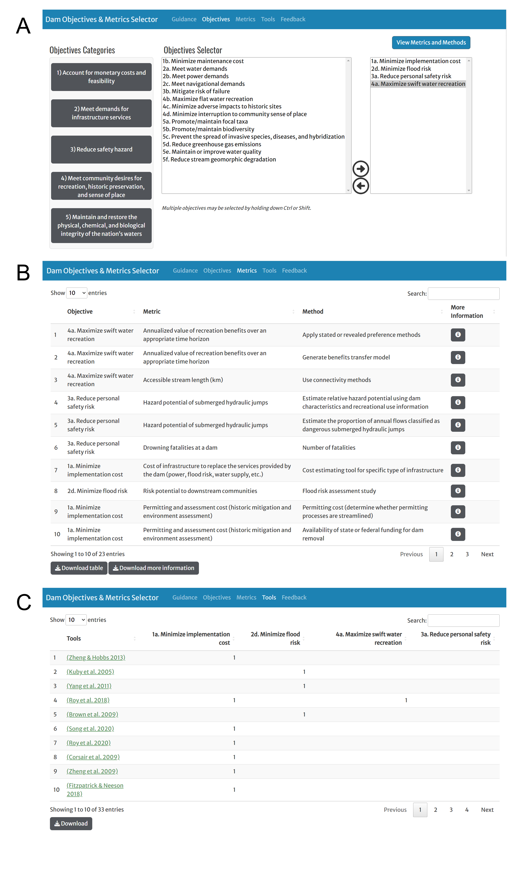

```{r setup, include=FALSE}
knitr::opts_chunk$set(echo = TRUE)
```

<style type="text/css">
  .watermark {
  opacity: 0.2;
  position: fixed;
  top: 0;
  left: 10%;
  right: 0;
  bottom: 0;
  z-index: -1;
  justify-content: center;
  align-content: center;
  font-size: 10em;
  color: #00407d;
  transform: rotate(-45deg)
}
</style>

<div class="watermark">DRAFT</div>

## Facilitating dam removal decisions with multiple objectives

*The following guidance is a draft. It has not been peer-reviewed. Opinions expressed here are those of the authors and not necessarily those of the agencies they represent or the N-EWN*


Laura C. Naslund^1^, Daniel Buhr^2^, Matt Chambers^2^, S. Kyle McKay^3^, Suman Jumani^3^, Brian Bledsoe^2^, Amy Rosemond^1^, Seth Wenger^1^ 

^1^Odum School of Ecology & River Basin Center, University of Georgia  
^2^School of Environmental, Civil, Agricultural, and Mechanical Engineering & The Institute for Resilient Infrastructure Systems (IRIS), University of Georgia  
^3^U.S. Army Engineer Research and Development Center, Environmental Laboratory  

### ABSTRACT
Proactive and transparent decision-making about the long-term management of dams, including rehabilitation, retrofit, and removal, is critical for successfully managing this aging infrastructure and presents an opportunity to weigh the many services and disservices dams provide. Existing tools to support dam removal decisions often constrain decision processes by considering only a limited set of user objectives. We identified 18 dam removal objectives in the literature and found that most of the 41 dam removal decision-support tools we evaluated included only two or three objectives. Common objectives of previous dam removals like reducing safety hazard and expanding recreational opportunities were included in few decision-support tools. To facilitate dam removal decisions with diverse objectives, we created a new web application which supports decisions with the 18 objectives that we identified in the literature. The application guides users to select appropriate objectives, choose metrics and methods to evaluate management alternatives, and identify additional decision-support tools to weigh alternatives relative to selected objectives. We demonstrate this web application as a resource for the dam management community of practice with a case study of a dam removal decision in Athens, Georgia, USA. More broadly, we propose the process outlined here as a model for aligning diverse objectives in other types of river infrastructure decisions. Given the contribution of this infrastructure to declining biodiversity, intensifying climate, and development needs, failing to align multiple objectives in river infrastructure decisions can represent consequential, missed opportunities.

### INTRODUCTION
Dam infrastructure has been critical to global economic development, but many dams and their reservoirs have exceeded their design lifetimes and are no longer fulfilling their constructed purposes (Gonzales & Walls, 2020; Perera et al., 2021). In the United States, decades of disinvestment in maintenance has also led to significant deficiencies, such that the American Society of Civil Engineers rated dams as one of the worst-performing categories of infrastructure (ASCE, 2021). The estimated cost to repair all known deficient, non-federal dams in the US National Inventory is $157.5 billion (ASDSO, 2023); however, this estimate includes only a fraction of the total number of dams in the US. For many deficient dams, removal may be a more economically efficient alternative to repair, particularly when the dam no longer serves its constructed purpose (Doyle, Stanley, et al., 2003; Grabowski et al., 2018; IEC, 2015). Even for functioning dams, removal may be the best long-term management strategy due to benefits for wildlife, water quality, recreation, safety, flood risk mitigation, and other services (Hansen et al., 2020). 

Dam management, including the decision of whether to remove a dam or which dams to remove, requires weighing the many services and disservices provided by a dammed versus a free-flowing stream, which can vary greatly according to local context (Habel et al., 2020). However, management decisions may not be made according to formal cost-benefit analyses, and the definition of the benefits provided by alternative actions may be disputed among interested parties (Grabowski et al., 2017; Habel et al., 2024). Additionally, dam decommissioning decisions encompass multiple scales of complexity including variation in the number and spatial relationship of dams considered for removal, dam size and impounded volume, diverse ownership, relevant legal authorities, and administrative frameworks (McKay et al., 2020; USSD, 2015). In part due to this complexity, most dams have been removed in an ad hoc manner despite calls for coordinated and structured decision processes (Doyle, Harbor, et al., 2003; Neeson et al., 2015). However, recent large infrastructure investments, such as the $3 billion allocated for dam decommissioning, rehabilitation, and retrofit in the 2021 U.S. Infrastructure Investment and Jobs Act (Pub. L. 117-58) (ASDSO, 2022), may open a policy window for more coordinated dam decision-making.

Several organizations have developed tools to support structured decision-making about dams, but existing tools may constrain options or lead to suboptimal outcomes if they do not include all relevant objectives of concern. We propose that decision-support tools could introduce automation bias in objectives selection: a tendency to favor outputs from automated over non-automated systems in decision-making. Identifying objectives is a critical early step in structured decision-making (Gregory & Keeney, 2002), and automation bias induced by a decision-support tool could lead to the premature elimination of relevant objectives. To facilitate decision-making inclusive of diverse objectives, we (1) compiled a list of objectives relevant to dam removal decisions, (2) examined their representation in existing dam removal decision-support tools which we identified in a literature search (n = 41, see below), (3) developed a new web application that links objectives to relevant metrics, methods, data sources, and decision-support tools, and (4) applied this web application to a case study about whether to remove a dam. We emphasize that the goal of this effort is not to contribute another multi-objective dam removal optimization tool, but rather to advocate for dam management decision processes that center clearly defined objectives. Our web application facilitates this process by aiding in the selection and application of dam management objectives in diverse deliberation contexts. 

### DAM REMOVAL OBJECTIVES AND THEIR REPRESENTATION IN DECISION-SUPPORT TOOLS
To identify common objectives in dam removal decisions and evaluate their inclusion in existing decision-support tools, we performed a two-stage search of the literature. We first conducted a preliminary literature review to develop an initial list of objectives of dam removal decisions. These objectives included motivations for dam removal (e.g., maximize swift water recreational opportunities) as well as services to be maintained regardless of the removal decision (e.g., meet navigational demands). We then refined this list as we conducted a second, structured review of existing decision-support tools to determine how frequently our identified objectives were included. For the structured review of existing dam removal decision-support tools, we searched Web of Science on April 11, 2022, using the search strings “(multiobjective OR multi-objective OR multicriteria OR multi-criteria) AND dam removal” as well as "prioritiz* AND (dam removal OR dam decommissioning)") and reviewed all results. Although the terms used for our search emphasize decisions to remove dams, we assert that decisions to retrofit or repair dams are the other side of the same coin, and generally encompass the same objectives. If dams are removed because their perceived costs outweigh their perceived benefits, it stands to reason that dams are retrofitted or repaired because they do currently or could provide perceived benefits in excess of their perceived costs after modifications (Parent et al., 2024). Therefore, we propose that the objectives which generate perceived costs and benefits are not materially different between these decision alternatives.

From the 86 results from our Web of Science search, we identified 9 additional, relevant papers that were not captured in our original search. We also reviewed 13 river barrier prioritization web applications identified by American Rivers (American Rivers, 2022). We included papers and applications (hereon referred to collectively as decision-support tools) returned by these search parameters which concerned optimal siting for dam construction, as many criteria are shared between dam construction and removal decisions. We did not include tools in our analysis if they only included metrics associated with a single objective (16% of evaluated literature, e.g., Kocovsky et al., 2009) or solely concerned water infrastructure other than dams (13% of evaluated literature, e.g., González-Zeas et al., 2019). Of the 108 evaluated tools and papers, 41 met our inclusion criteria. In total, we identified 18 common objectives of dam removal, which we organized into five categories (Table 1).

**Table 1**. Common objectives of dam removal identified by a literature review.

| Category | Objective |
| -------- | ---------- |
| 1. Account for monetary costs and feasibility                                                         | 1a. Minimize implementation costs                                                                                     |
|                                                                                                       | 1b. Minimize maintenance costs                                                                                        |
| 2. Meet demands for infrastructure services                                                           | 2a. Meet water demands                                                                                                |
|                                                                                                       | 2b. Meet power generation demands                                                                                     |
|                                                                                                       | 2c. Meet navigation demands                                                                                           |
|                                                                                                       | 2d. Reduce flood risk                                                                                                 |
| 3. Reduce safety hazard                                                                               | 3a. Reduce personal safety risk                                                                                       |
|                                                                                                       | 3b. Mitigate risk of failure                                                                                          |
| 4. Meet community desires for use of rivers for recreation, historic preservation, and sense of place | 4a. Maximize swift water recreational opportunities                                                                   |
|                                                                                                       | 4b. Maximize flat water recreational opportunities                                                                    |
|                                                                                                       | 4c. Minimize adverse impacts to sites judged by the community, state, or Nation to be historically significant places |
|                                                                                                       | 4d. Minimize interruption to community sense of place                                                                 |
| 5. Maintain and restore the physical, chemical, and biological integrity of the Nation’s waters       | 5a. Promote/maintain a population or community of focal taxa                                                          |
|                                                                                                       | 5b. Promote/maintain biodiversity                                                                                     |
|                                                                                                       | 5c. Prevent the spread of invasive species, disease, or undesirable hybridization                                     |
|                                                                                                       | 5d. Reduce greenhouse gas emissions                                                                                   |
|                                                                                                       | 5e. Maintain or improve water quality                                                                                 |
|                                                                                                       | 5f. Reduce stream geomorphic degradation                                                                              |


As stated above, the terms used for our structured search of decision-support tools emphasized dam removal rather than retrofit or repair. It is possible that tools explicitly designed for dam retrofit and repair decisions not captured by our search represent objectives differently than the results reported below. Out of 41 dam removal decision-support tools, only ten included more than three objectives. The tool with the greatest number of objectives included 9 of the 18 we identified (Brown et al., 2009). Supporting/maintaining a population or community of focal taxa was the most frequently included objective (33/41 tools), followed by minimizing implementation cost (29/41 tools) (Figure 1). Unsurprisingly, these objectives were the most frequently co-occurring, followed by the combination of supporting/maintaining a population or community of focal taxa and meeting power generation needs (Figure 2). No tool included the objective reduce stream geomorphic degradation (Schmidt & Wilcock, 2008). The objectives reduce personal safety risk, maximize swift water recreational opportunities, maximize flat water recreational opportunities, minimize adverse impacts to sites judged by the community, state or nation to be historically significant places were each represented in only one tool. Because these objectives were poorly represented in existing decision-support tools, we identified them as high priorities for metric development. We anticipated that developing metrics for these objectives would facilitate their inclusion in structured decision-making for evaluating management alternatives. 


```{r fig. 1, echo=FALSE, out.width = '50%'}

```

**Figure 1**. Frequency of A) occurrence and B) co-occurrence of identified objectives among existing dam removal decision-support tools (n = 41).

### IDENTIFYING METRICS AND METHODS FOR QUANTIFYING OUTCOMES
Metrics operationalize objectives by describing the extent to which a decision alternative achieves an objective (Keeney & Gregory, 2005; McKay et al., 2012). Metrics can be quantified using different methods. For example, the accessibility of the river network to an organism, often called network connectivity (a metric associated with Objective 5a), can be calculated assuming that dams are impassable barriers. Alternatively, connectivity can be calculated assuming that a proportion of an aquatic organism’s population (0-100%) can traverse the dam (McKay et al., 2017). In addition to assumptions about barrier navigability, connectivity can also be estimated using different indices (Jumani et al., 2020). To varying degrees, metrics abstract the processes which generate an outcome (i.e., the achievement of an objective) from an action (e.g., dam removal). If a metric substantially mischaracterizes this process, using it may lead to suboptimal decisions (Keeney & Gregory, 2005). For example, assigning higher scores to alternatives that yield greater river network connectivity assumes that dam removal will have a positive impact on the focal population by providing greater access to the river network. Connectivity metrics will fail to capture this objective if the organism is more constrained by factors other than connectivity, such as unsuitable water temperature or nutrient pollution (Reid et al., 2019). 

We compiled metrics and methods associated with our 18 identified objectives from the literature and developed additional metrics and methods where we identified gaps (Supporting Information). We organized these linked objectives, metrics, and methods along with their required data sources in an interactive web application called the Dam Objectives & Metrics Selector Application (https://lnaslund.shinyapps.io/MCDA/) (Figure 2, more details in Supporting Information). This web application can be used to populate different frameworks for evaluating tradeoffs among proposed alternatives, and the application automatically produces a list of decision support tools that include the user’s selected objectives. We see the application not as a stand-alone tool, but as a complementary application to support critical thinking about the objectives of dam management and to guide users to resources that align with their objectives. For example, an analyst who wishes to employ optimization methods could use the tool to identify computationally efficient metrics to parameterize their selected objectives and constraints. An analyst who wishes to employ scoring and ranking methods could use the tool to identify metrics for parameterizing objectives that are difficult to quantify like minimizing interruption to community sense of place (Objective 4d). 

### INTENDED USE CASES OF THE APPLICATION
The Dam Objectives & Metrics Selector Application is intended to support decisions with a diversity of decision alternatives including dam removal, partial removal, repair, retrofit, or no action. Our primary aim in developing this application is to promote critical thinking about the objectives of dam management decisions to reduce the likelihood of premature elimination of relevant objectives due to automation bias. The application, therefore, intentionally does not specify suitable decision alternatives. Additionally, the application is intended to support decisions about a single as well as multiple dams. We provide an example for a single dam decision and guidance for multiple dam decisions below. In a decision involving multiple dams, the decision process likely will differ depending on whether the dams are owned by a single or multiple entities. Single owner decisions, which we call “portfolio decisions,” are most applicable to infrastructure utilities and government agencies. In a portfolio decision, the decision-maker may know a great deal about their dams and primary objectives. In this case, the Dam Objectives and Metrics Selector Application may be useful in quantifying the co-benefits of a decision, for example to assess the effects of decision alternatives on other stakeholders or gauge the likely level of public support for alternatives. In an initial prioritization of removals in a dam portfolio, the analyst may wish to use readily-assessed indirect metrics to provide a first-order approximation. For example, for Objective 4a (maximizing swift water recreation), the decision analyst may choose to estimate stream length accessible to river recreators under different removal scenarios using connectivity methods to identify a few desirable removal scenarios. Once a few scenarios have been identified, the analyst may wish to refine their estimates by assessing the annualized monetary value of recreation under each scenario using stated or revealed preference methods with primary survey data (Loomis, 2002; Platt, 2003). The Dam Objectives and Metrics Selector Application provides multiple metrics for most objectives to accommodate both stages of decisions.

Prioritizations for the removal of dams with different owners are typically initiated by a non-owner entity whose mission is related to specific objectives, such as fish passage. This entity may serve in a facilitation role to identify potentially beneficial removals and bring together various stakeholders. We envision that the Dam Removal and Objective Selector Application will be particularly valuable in identifying priority objectives in such a decision context, because collaborative decision efforts can stall at the stage of defining objectives when stakeholders are unable to articulate objectives from their values or recognize the coherence among priorities stated in slightly different ways (Gregory et al., 2012). This application may streamline the objectives definition process by providing a common language for objectives and their categories that stakeholders can use to locate their priorities and ensure that important objectives are not excluded. As in portfolio decisions, the application can also be useful for identifying metrics appropriate to the decision stage. The identified objectives and metrics can then be used within existing dam removal decision-support frameworks (Jumani et al., 2023) or optimization tools (Kemp & O’Hanley, 2010; Kuby et al., 2005) to facilitate strategic dam removal or restoration planning.

```{r fig. 2, echo=FALSE, out.width = '70%'}

```

**Figure 2**. The Dam Objectives & Metrics Selector web application. A) The user selects objectives of dam removal from the objectives tab using the information provided in the grey buttons organized by objective category. B) The metrics tab displays metrics and methods associated with the selected objectives and provides additional information, including citations and data sources in the information buttons. C) The tools tab displays the decision-support tools in the literature review (41 tools total) which include the user’s selected objectives.

### DECISION SUPPORT IN A SINGLE DAM REMOVAL (WHITE DAM, ATHENS, GA, USA)
We illustrate the utility of the Dam Objectives and Metrics Selector Application for evaluating decisions about a single dam using a post-hoc evaluation of the White Dam in Athens, Georgia, USA, which was partially removed in 2018 (Figure 3). Our intention is not to reconstruct the decision process that led to the partial removal of White Dam, but to use this example to illustrate the utility of the application. The White Dam was a concrete gravity dam which spanned the Middle Oconee River. It was constructed in 1913 for hydropower and was in operation until the 1950s. In 1978, the dam was acquired by the University of Georgia as part of a land donation (The Georgia Aquatic Connectivity Team, 2020). In 2014, university staff proposed the removal of White Dam to reduce liability from hazards to recreational safety (Objective 3a) caused by large wood jams that occasionally formed at the structure (Figure 3) (The Georgia Aquatic Connectivity Team, 2020). The project team considered four management alternatives: 1) do nothing, 2) completely remove the dam, 3) leave the dam in place and construct a bypass channel, 4) remove the center section of the dam wall but leave the remaining structure in place (partial removal) (The Georgia Aquatic Connectivity Team, 2020).

The web application provides a platform to systematically consider the relevance of objectives to a removal decision (Table 2). When the relevance of an objective is unknown, the metrics and methods in the application may be used to identify ways to determine its relevance (Table 2). Using the application, we identified six relevant objectives and selected appropriate metrics and methods (Table 2). For the four objectives with unknown relevance, we identified metrics and methods from the application to evaluate their inclusion in the decision process (Table 2). As objectives are determined to be relevant by this evaluation, the process of considering tradeoffs among alternatives may be iterated. We note that none of the decision-support tools identified in the structured review included all six of the relevant objectives identified for the White Dam, illustrating the utility of the web application for minimizing the risk of premature elimination of objectives.

**Table 2**. Systematic consideration of the relevance of the objectives in the Dam Objectives and Metrics Selector Application to the White Dam removal, Middle Oconee River, Athens, Georgia, USA. For relevant objectives, a metric/method is provided to evaluate alternatives according to their achievement of the objective. For objectives with unknown relevance, a metric/method is provided to help determine their relevance.

| Objective                                                                                                             | Relevance    | Justification                                                                                                                                                                                                                                                | Metric: Method                                                                                                                                                                                                              |
|-----------------------------------------------------------------------------------------------------------------------|--------------|--------------------------------------------------------------------------------------------------------------------------------------------------------------------------------------------------------------------------------------------------------------|-----------------------------------------------------------------------------------------------------------------------------------------------------------------------------------------------------------------------------|
| 1a. Minimize implementation costs                                                                                     | Relevant     | The dam owners had additional funding priorities.                                                                                                                                                                                                            | Cost of removing the dam and appurtenant structures or constructing the by-pass channel: consult relevant experts                                                                                                           |
| 1b. Minimize maintenance costs                                                                                        | Relevant | Although the dam provided no infrastructure services to supplant upon removal, maintaining the dam required the owner to regularly clear the debris which accumulated behind the dam.                                                                                                                                                                                                     | Dam maintenance cost: consult relevant experts                                                                                                                                                                                                                            |
| 2a. Meet water demands                                                                                                | Not relevant | No water intakes were served by the dam.                                                                                                                                                                                                                     |                                                                                                                                                                                                                             |
| 2b. Meet power generation demands                                                                                     | Not relevant | Power production potential was determined to be uneconomical in the 1980s.                                                                                                                                                                                   |                                                                                                                                                                                                                             |
| 2c. Meet navigation demands                                                                                           | Not relevant | The river does not support commercial navigation and the dam did not support terrestrial navigation.                                                                                                                                                         |                                                                                                                                                                                                                             |
| 2d. Reduce flood risk                                                                                                 | Not relevant | The dam did not have the capacity to impound substantial volumes of water.                                                                                                                                                                                   |                                                                                                                                                                                                                             |
| 3a. Reduce personal safety risk                                                                                       | Relevant     | The debris build-up behind the dam could entangle recreators.                                                                                                                                                                                                | Relative hazard potential: use dam characteristics and recreational use information                                                                                                                                         |
| 3b. Mitigate risk of failure                                                                                          | Not relevant | The dam did not have a hazard potential rating.                                                                                                                                                                                                              |                                                                                                                                                                                                                             |
| 4a. Maximize swift water recreational opportunities                                                                   | Relevant     | The dam impeded the passage of swift water recreators during some conditions.                                                                                                                                                                                | Accessible stream length : use connectivity methods                                                                                                                                                                         |
| 4b. Maximize flat water recreational opportunities                                                                    | Not relevant | The dam did not impound a sufficient volume of water to support flat water recreation.                                                                                                                                                                       |                                                                                                                                                                                                                             |
| 4c. Minimize adverse impacts to sites judged by the community, state, or Nation to be historically significant places | Relevant     | The dam was over 50 years old, retained its original setting, location, and many of the original materials (including the original machinery in the powerhouse). These characteristics met criteria for listing in the National Register of Historic Places. | Register of historic places listing: determine eligibility for listing                                                                                                                                                      |
| 4d. Minimize interruption to community sense of place                                                                 | Unknown      | Although there was not a clear public access point to the dam, it was accessible to the university community and recreators traveling from other access points.                                                                                              | Community preference: survey community                                                                                                                                                                                      |
| 5a. Promote/maintain a population or community of focal taxa                                                          | Relevant     | Consultation with other stakeholders revealed that the dam also posed a barrier to movement of the Altamaha shiner (*Cyprinella xaenura*), which is listed as threatened by the Georgia Department of Natural Resources.                                       | Accessible stream length: use connectivity methods                                                                                                                                                                          |
| 5b. Promote/ maintain biodiversity                                                                                    | Unknown      | The extent to which loss of connectivity or other environmental conditions caused by the dam constrained local biodiversity is unknown.                                                                                                                      | Current watershed, riparian, instream physical and/or chemical condition: assess severity of other stressors                                                                                                                |
| 5c. Prevent the spread of invasive species, disease, or undesirable hybridization                                     | Not relevant | Removal had negligible chance of increasing risks of invasive species, diseases, or undesirable hybridization                                                                                                                                                |                                                                                                                                                                                                                             |
| 5d. Reduce greenhouse gas emissions                                                                                   | Unknown      | The effect of the dam on greenhouse gas emissions was unknown.                                                                                                                                                                                               | Estimate current contribution of the dam to greenhouse gases emissions: measure CO2 and CH4 emissions along a transect upstream to downstream of the dam to determine if there are elevated emissions in the impounded area |
| 5e. Maintain or improve water quality                                                                                 | Unknown      | The effect of the dam on water quality was unknown.                                                                                                                                                                                                          | Current water quality: measure relevant parameters (e.g., temperature, dissolved oxygen) upstream to downstream of the dam to evaluate the impact of the dam on water quality                                               |
| 5f. Reduce stream geomorphic degradation                                                                              | Not relevant | Negligible sediment storage and high background sediment transport rates indicated that dam removal had minimal potential effect on geomorphology                                                                                                            |                                                                                                                                                                                                                             |
```{r fig. 3, echo=FALSE, out.width = '50%'}
knitr::include_graphics("www/fig3_b.png")
```

**Figure 3**. Photograph of White Dam, Athens, GA, USA. The star on the inset map represents the dam location

### OUTLOOK
Decision analyses often result in the selection of a suboptimal alternative early in the decision process due to failure to define all objectives or to select appropriate metrics and methods to parameterize those objectives (Hemming et al., 2022). The purpose of the Dam Removal Objectives and Metrics Selector Application is to facilitate critical thinking to ensure that appropriate management objectives, metrics, and methods are considered in the decision process. Using this application to identify objectives and select metrics/methods may reveal key uncertainties that require additional analysis. The application may also be useful to inform dam owners about the diverse objectives of dam removal, to identify consistent categories of benefits to compile and report the consequences of multiple projects, and to identify opportunities to align benefits and diverse project funding sources. For example, the U.S. Infrastructure Investment and Jobs Act allocated dam-related funding to over a dozen programs in nine different federal agencies. Approximately $900 M was allocated to improve existing dam safety, $800 M for dam removal, $800 M for hydropower dam safety and retrofit, and several hundred million to programs that can fund additional dam safety projects. The Dam Removal Objectives and Metrics Selector Application may be useful in organizing discussions of shared and distinct objectives across programs and agency mandates to use these funds efficiently and effectively.

More broadly, we propose this process—identifying common objectives, metrics, methods, and decision frameworks—as a model to facilitate structured decision-making for other types of river infrastructure decisions (e.g., decisions about levees and navigation dredging). Historically, many forms of infrastructure were constructed to meet a single, primary objective (National Academies of Science, Engineering, and Medicine, 2022). In a world facing the interacting crises of biodiversity loss, climate change, and infrastructure deterioration, we maintain that single objective decision-making leads to less efficient outcomes, including missed opportunities to align important objectives. 

### ACKNOWLEDGEMENTS
This research was conducted as part of the Network for Engineering with Nature (N-EWN, https://n-ewn.org). This work was supported by the US Army Corps of Engineers Engineering With Nature® Initiative through Cooperative Ecosystem Studies Unit Agreement W912HZ-20-20031. The use of products or trade names does not represent an endorsement by either the authors or the N-EWN. Opinions expressed here are those of the authors and not necessarily those of the agencies they represent or the N-EWN.

### REFERENCES
American Rivers. (2022). River Barrier Prioritizations. https://www.americanrivers.org/river-barrier-priortizations/

ASCE. (2021). 2021 Report Card for America’s Infrastructure. American Society of Civil Engineers. https://infrastructurereportcard.org/wp-content/uploads/2020/12/National_IRC_2021-report.pdf

ASDSO. (2022). Infrastructure Investment and Jobs Act Summary—Investment in Dams: Rehabilitation, Retrofit & Removal. https://damsafety-prod.s3.amazonaws.com/s3fs-public/pictures/ASDSO%20-%20IIJA%20Summary%20for%20Dams.pdf

ASDSO. (2023). The Cost of Rehabilitating Dams in the U.S. Association of State Dam Safety Officials. https://damsafety-prod.s3.amazonaws.com/s3fs-public/files/2023%20ASDSO%20Costs%20of%20Dam%20Rehab%20Report.pdf

Brown, P. H., Tullos, D., Tilt, B., Magee, D., & Wolf, A. T. (2009). Modeling the costs and benefits of dam construction from a multidisciplinary perspective. Journal of Environmental Management, 90, S303–S311. https://doi.org/10.1016/j.jenvman.2008.07.025

Doyle, M. W., Harbor, J. M., & Stanley, E. H. (2003). Toward Policies and Decision-Making for Dam Removal. Environmental Management, 31(4), 453–465. https://doi.org/10.1007/s00267-002-2819-z

Doyle, M. W., Stanley, E. H., Harbor, J. M., & Grant, G. S. (2003). Dam removal in the United States: Emerging needs for science and policy. Eos, 84(4), 29–33. https://doi.org/10.1029/2003EO040001

Gonzales, V., & Walls, M. (2020). Dams and Dam Removals in the United States (p. 28). Resources for the Future. https://www.rff.org/publications/reports/dams-and-dam-removals-united-states/

González-Zeas, D., Rosero-López, D., Walter, T., Flecker, A., Lloret, P., De Bièvre, B., Condom, T., Osorio, R., & Dangles, O. (2019). Designing Eco-Friendly Water Intake Portfolios in a Tropical Andean Stream Network. Water Resources Research, 55(8), 6946–6967. https://doi.org/10.1029/2019WR025190

Grabowski, Z. J., Chang, H., & Granek, E. F. (2018). Fracturing dams, fractured data: Empirical trends and characteristics of existing and removed dams in the United States. River Research and Applications, 34(6), 526–537. https://doi.org/10.1002/rra.3283

Grabowski, Z. J., Denton, A., Rozance, M. A., Matsler, M., & Kidd, S. (2017). Removing Dams, Constructing Science: Coproduction of Undammed Riverscapes by Politics, Finance, Environment, Society and Technology. 10(3).

Gregory, R., Failing, L., Harstone, M., Long, G., McDaniels, T., & Ohlson, D. (2012). Structured Decision Making: A Practical Guide to Environmental Management Choices. Wiley-Blackwell.

Gregory, R. S., & Keeney, R. L. (2002). Making Smarter Environmental Management Decisions. Journal of the American Water Resources Association, 38(6), 1601–1612. https://doi.org/10.1111/j.1752-1688.2002.tb04367.x

Habel, M., Mechkin, K., Podgorska, K., Saunes, M., Babiński, Z., Chalov, S., Absalon, D., Podgórski, Z., & Obolewski, K. (2020). Dam and reservoir removal projects: A mix of social-ecological trends and cost-cutting attitudes. Scientific Reports, 10, 19210. https://doi.org/10.1038/s41598-020-76158-3

Habel, M., Mechkin, K., Wagner, I., Grabowski, Z., Kaczkowski, Z., Absalon, D., Szatten, D., Matysik, M., Pytel, S., Jurczak, T., & Obolewski, K. (2024). Dammed context: Community perspectives on ecosystem service changes following Poland’s first dam removal. Land Degradation & Development, 35(6), 2184–2200. https://doi.org/10.1002/ldr.5053

Hansen, H. H., Forzono, E., Grams, A., Ohlman, L., Ruskamp, C., Pegg, M. A., & Pope, K. L. (2020). Exit here: Strategies for dealing with aging dams and reservoirs. Aquatic Sciences, 82, 2. https://doi.org/10.1007/s00027-019-0679-3

Hemming, V., Camaclang, A. E., Adams, M. S., Burgman, M., Carbeck, K., Carwardine, J., Chadès, I., Chalifour, L., Converse, S. J., Davidson, L. N. K., Garrard, G. E., Finn, R., Fleri, J. R., Huard, J., Mayfield, H. J., Madden, E. M. D., Naujokaitis-Lewis, I., Possingham, H. P., Rumpff, L., … Martin, T. G. (2022). An introduction to decision science for conservation. Conservation Biology, 36, e13868. https://doi.org/10.1111/cobi.13868

IEC. (2015). Economic & Community Benefits from Stream Barrier Removal Projects in Massachusetts. Massachusetts Department of Fish and Game. https://www.mass.gov/doc/phase-3-economic-community-benefits-from-stream-barrier-removal-projects-in-massachusetts/download

Jumani, S., Andrews, L., Grantham, T. E., McKay, S. K., Duda, J., & Howard, J. (2023). A decision‐support framework for dam removal planning and its application in northern California. Environmental Challenges, 12, 100731. https://doi.org/10.1016/j.envc.2023.100731

Jumani, S., Deitch, M. J., Kaplan, D., Anderson, E. P., Krishnaswamy, J., Lecours, V., & Whiles, M. R. (2020). River fragmentation and flow alteration metrics: A review of methods and directions for future research. Environmental Research Letters, 15(12), 123009. https://doi.org/10.1088/1748-9326/abcb37

Keeney, R. L., & Gregory, R. S. (2005). Selecting Attributes to Measure the Achievement of Objectives. Operations Research, 53(1), 1–11. https://doi.org/10.1287/opre.1040.0158

Kemp, P. S., & O’Hanley, J. R. (2010). Procedures for evaluating and prioritising the removal of fish passage barriers: A synthesis. Fisheries Management and Ecology, 17(4), 297–322. https://doi.org/10.1111/j.1365-2400.2010.00751.x

Kocovsky, P. M., Ross, R. M., & Dropkin, D. S. (2009). Prioritizing removal of dams for passage of diadromous fishes on a major river system. River Research and Applications, 25, 107–117. https://doi.org/10.1002/rra

Kuby, M. J., Fagan, W. F., ReVelle, C. S., & Graf, W. L. (2005). A multiobjective optimization model for dam removal: An example trading off salmon passage with hydropower and water storage in the Willamette basin. Advances in Water Resources, 28(8), 845–855. https://doi.org/10.1016/j.advwatres.2004.12.015

Loomis, J. (2002). Quantifying recreation use values from removing dams and restoring free-flowing rivers: A contingent behavior travel cost demand model for the Lower Snake River. Water Resources Research, 38(6), 2-1-2–8. https://doi.org/10.1029/2000wr000136

McKay, S. K., Cooper, A. R., Diebel, M. W., Elkins, D., Oldford, G., Roghair, C., & Wieferich, D. (2017). Informing Watershed Connectivity Barrier Prioritization Decisions: A Synthesis. River Research and Applications, 33(6), 847–862. https://doi.org/10.1002/rra.3021

McKay, S. K., Linkov, I., Fischenich, J. C., Miller, S. J., & Valverde, L. J. (2012). Ecosystem restoration objectives and metrics. ERDC TN-EMRRP-EBA-16, US Army Engineer Research and Development Center, Vicksburg, Mississippi.

McKay, S. K., Martin, E. H., McIntyre, P. B., Milt, A. W., Moody, A. T., & Neeson, T. M. (2020). A comparison of approaches for prioritizing removal and repair of barriers to stream connectivity. River Research and Applications, 36(8), 1754–1761. https://doi.org/10.1002/rra.3684

National Academies of Science, Engineering, and Medicine. (2022). Benefits, Applications, and Opportunities of Natural Infrastructure: Proceedings of a Workshop in Brief. The National Academies Press. https://doi.org/10.17226/26660

Neeson, T. M., Ferris, M. C., Diebel, M. W., Doran, P. J., O’Hanley, J. R., & McIntyre, P. B. (2015). Enhancing ecosystem restoration efficiency through spatial and temporal coordination. Proceedings of the National Academy of Sciences of the United States of America, 112(19), 6236–6241. https://doi.org/10.1073/pnas.1423812112

Parent, J. R., Gold, A. J., Vogler, E., & Lowder, K. A. (2024). Guiding decisions on the future of dams: A GIS database characterizing ecological and social considerations of Dam decisions. Journal of Environmental Management, 351, 119683. https://doi.org/10.1016/j.jenvman.2023.119683

Perera, D., Smakhtin, V., Williams, S., North, T., & Curry, A. (2021). Ageing Water Storage Infrastructure: An Emerging Global Risk. United Nations University Institute for Water, Environment and Health.

Platt, J. (2003). Economic Analysis of Dam Decommissioning (EC-2003-01). U.S. Bureau of Reclamation. https://www.usbr.gov/tsc/techreferences/economics/DamRemovalPaper2.pdf

Reid, A. J., Carlson, A. K., Creed, I. F., Eliason, E. J., Gell, P. A., Johnson, P. T. J., Kidd, K. A., MacCormack, T. J., Olden, J. D., Ormerod, S. J., Smol, J. P., Taylor, W. W., Tockner, K., Vermaire, J. C., Dudgeon, D., & Cooke, S. J. (2019). Emerging threats and persistent conservation challenges for freshwater biodiversity. Biological Reviews, 94(3), 849–873. https://doi.org/10.1111/brv.12480

Schmidt, J. C., & Wilcock, P. R. (2008). Metrics for assessing the downstream effects of dams. Water Resources Research, 44, W04404. https://doi.org/10.1029/2006WR005092

The Georgia Aquatic Connectivity Team. (2020). Removal or Modification of Obsolete Dams in Georgia and Dam Owners. https://ga-act.org/georgia-dam-handbook/

USSD. (2015). Guidelines for Dam Decommissioning Projects. United States Society on Dams.


### SUPPORTING INFORMATION

**Elaboration of author contributed metrics/methods**

*Objective 1a. Cost of repairing dam and appurtenant structures*: Because repair/retrofit and removal likely incur different costs, we include repair costs as a separate metric. We recommend using expert evaluation or the Association of State Dam Safety Officials (ASDSO)’s cost estimation method which is based on previous project costs and dam characteristics.

*Objective 1b. Loss of tax revenue*: If dam removal decreases the value of surrounding properties, it may contribute to lower tax revenue. The impact of dam removal on property values is not well understood, and evidence of the effects of small dam removals on property values is mixed. We recommend expert evaluation to predict the loss of property value with dam removal and the subsequent loss of tax revenue. We define this loss as a maintenance cost because it is incurred on an on-going basis. We also note that in cases where dam removal could reduce property values, riparian residents will also likely oppose removal, which is a metric for objective 4d) minimize interruption to community sense of place. 

*Objective 2a. Change in water surface elevation relative to water intakes*: A chief concern of municipalities regarding water supply is the elevation of their intake pipes, particularly during low-flow periods. For reservoirs where dam decommissioning is considered, it is imperative that the post-removal water surface elevation remains adequately high to maintain withdrawal through the current intake; otherwise, the cost of installing a new intake should be accounted for in the decision process. We recommend the use of an appropriate hydraulic model to estimate water surface elevation during low flow periods.

*Objective 2a. Change in local average groundwater table depth*: Twenty-five percent of water use in the US is from groundwater (Dieter et al., 2018), which is connected to reservoirs through surface water-groundwater exchange. In regions where this is a potential issue, dam decommissioning analyses should include groundwater modeling to evaluate how changes to stream and reservoir elevations propagate into the local aquifer to ensure that groundwater supply is not compromised (Berthelote, 2013). 

*Objective 2b. Users of dam power*: The population served by dam-generated power provides an additional element for understanding its importance for service delivery. 

*Objective 2c. Users of in-stream dam navigation*: The annualized number of vessels using a dam for navigation is an indicator of its importance for transportation. 

*Objective 2c. Users of terrestrial dam navigation*: The annualized number of vehicle or axle crossings over a dam is an indicator of its importance for transportation.

*Objective 2c. Proximity to nearest alternative stream-crossing infrastructure*:  An important consideration when evaluating decommissioning options is to determine the distance traffic must be re-routed to cross the stream if the road that a dam supports is removed. This is useful to couple with the metric for number of vehicles crossing the road over the dam to determine the complete effect of removing that road (e.g., if traffic must be re-routed, is the amount of traffic or re-routed distance sufficiently low?).

*Objective 3a. Proportion of annual flows classified as dangerous submerged hydraulic jumps*: Low head dams can be a significant hazard for dangerous submerged hydraulic jumps, but that hazard is dependent on flow conditions over the dam (Poff & Hotchkiss, 2023). Whereas the other provided method for this metric evaluated potential hazard based on simple dam characteristics, this method provides a more detailed assessment for how frequently these dangerous flows may occur. Combining flow frequency analysis with physical dam measurements to estimate this hazard helps decision makers quantify the prevalence of life-threatening flow conditions. 

*Objective 4a. Accessible stream length*: Dams can impede swiftwater recreation by creating barriers to the movement of small craft like kayaks, canoes, and rafts. Connectivity methods can be used to estimate the changes to accessible areas for swiftwater recreation under different dam removal alternatives.

*Objective 4b. Accessible flat-water area*: Dams can create opportunities for flat-water recreation like motorized boating, swimming, and paddle boarding. Calculating accessible flat-water area can indicate opportunities for this type of recreation under different dam removal alternatives.

*Objective 4c. Average community ranking of historical significance*: Sites without formal historical recognition (e.g., National Register of Historic Places) may still be important to a community’s historic memory (Fox et al., 2016). Asking community members to rank their evaluation of a dam’s historical significance with other places in the community could indicate the relative importance of the dam to the community’s historic memory.

*Objective 5e. Net water quality improvement*: Dam decommissioning can have variable effects on many aspects of water quality (e.g., temperature, dissolved oxygen, sediment, nutrients, etc.), so it is important to estimate the direction and magnitude of these changes. Generating a water quality model can inform a quantitative assessment of potential local and downstream benefits of dam decommissioning. 

*Objective 5f. Net change in channel width/depth ratio, slope*: Dam decommissioning can release a volume of sediment that alters the local and downstream channel morphology, affecting flow characteristics and connection to the floodplain. Common methods to quantify the effects of bed and bank erosion are through channel slope and width-depth ratio. Substantial shifts in these parameters can trigger channel instability and impair stream and riparian function.

*Objective 5f. Erosion potential*: Erosion potential assesses the susceptibility of the stream to erode based on the amount of sediment available and the stream’s ability to move that sediment. This is imperative to understanding potential geomorphic channel change that may result from dam decommissioning.

**Elaboration of application features**
We constructed the Dam Objectives & Metrics Selector web application using R Shiny version 1.7.4 (Chang et al., 2022). The Guidance landing page hosts this manuscript to provide context on the intended use of this application. On the Objectives tab, the user can select from among the listed objectives, and the associated metrics and methods will be displayed in a table on the Metrics tab. Clicking on the Objectives Categories labels displays dialogue boxes containing definitions and justifications for each of the objectives in the selected category. Similarly, clicking the information icon associated with each of the methods in the table in the Metrics tab displays a dialogue box containing information about the data requirements and sources for that method as well as citations. Methods not derived from existing published literature are cited as “Authors.” The content of the table displayed in the Metrics tab can be downloaded by clicking the “Download table” button, and the accompanying information in the “more information” icons can be downloaded by clicking the “Download more information” button. The Tools tab displays a table of citations for tools which include the user’s selected objectives to support the identification of appropriate methods for evaluating tradeoffs among user specified objectives. This table can be downloaded by clicking the “Download” button. Our intention with including links to the source literature for metrics, methods, and tools is to direct users to review the source material to determine whether they can apply the cited resource to their own application as is or if it needs to be modified. The final Feedback tab provides a space for users to alert the authors to additional resources to include in the application. By this mechanism, we envision the application as a dynamic community resource. 

**References**

Berthelote, A. R. (2013). Forecasting groundwater responses to dam removal. University of Montana.

Chang, W., Cheng, J., Allaire, J., Sievert, C., Schloerke, B., Xie, Y., Allen, J., McPherson, J., Dipert, A., & Borges, B. (2022). shiny: Web Application Framework for R [R package version 1.7.2]. https://CRAN.R-project.org/package=shiny

Dieter, C. A., Maupin, M. A., Caldwell, R. R., Harris, M. A., Ivahnenko, T. I., Lovelace, J. K., Barber, N. L., & Linsey, K. S. (2018). Estimated Use of Water in the United States in 2015. In U.S. Geological Survey Circular 1441 (pp. 1–76). https://pubs.er.usgs.gov/publication/cir1441%0Ahttps://bit.ly/2PR0B5H

Fox, C. A., Magilligan, F. J., & Sneddon, C. S. (2016). “You kill the dam, you are killing a part of me”: Dam removal and the environmental politics of river restoration. Geoforum, 70, 93–104. https://doi.org/10.1016/j.geoforum.2016.02.013

Poff, J. W., & Hotchkiss, R. H. (2023). Stream Slope as an Indicator for Drowning Potential at Low Head Dams. Water, 15(3), Article 3. https://doi.org/10.3390/w15030512
